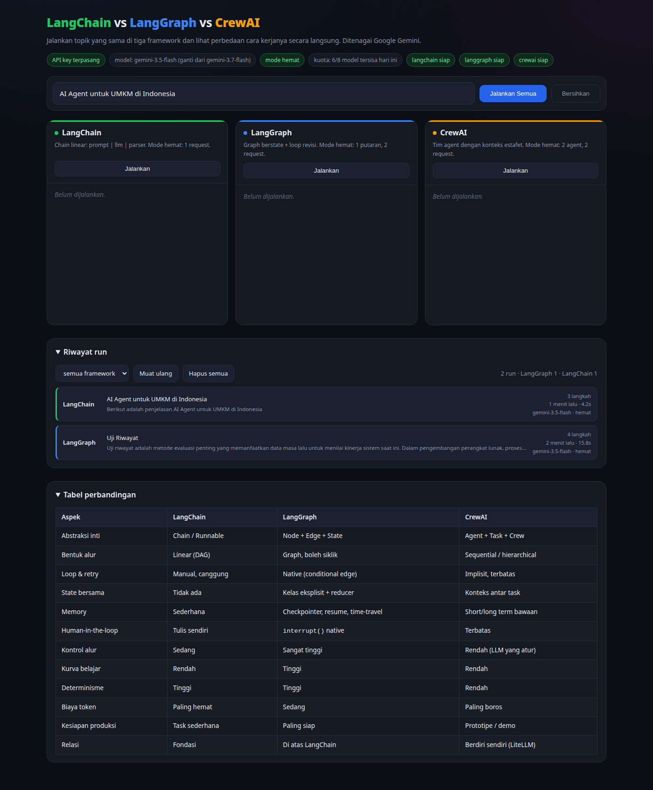

# Demo: LangChain vs LangGraph vs CrewAI

Tiga framework AI agent, satu topik yang sama, ditenagai **Google Gemini**.
Lengkap dengan UI web untuk membandingkan hasilnya berdampingan secara live.

 



---

## Setup (3 langkah)

### 1. Ambil API key Gemini (gratis)

Buka <https://aistudio.google.com/apikey> lalu klik **Create API key**.

### 2. Isi `.env`

```bash
cp .env.example .env
nano .env        # tempel key-mu di GOOGLE_API_KEY=
```

Isi file `.env`:

```
GOOGLE_API_KEY=AIzaSy...punyamu
GEMINI_MODEL=gemini-3.7-flash
```

### 3. Jalankan

```bash
./run.sh
```

Buka <http://127.0.0.1:8765>

---

## Kenapa harus venv?

Sistem ini punya **Python 3.14**, sedangkan `crewai` dan beberapa dependensinya
belum mendukung 3.14. Karena itu `run.sh` otomatis membuat virtualenv dengan
**Python 3.11**. Kalau menginstall manual dengan `pip install` di Python 3.14,
akan gagal build. Ini penyebab error install yang kamu alami sebelumnya.

Setup manual jika perlu:

```bash
python3.11 -m venv .venv
.venv/bin/pip install -r demo/requirements.txt
.venv/bin/python demo/app.py
```

---

## Isi proyek

| File | Isi |
|---|---|
| `demo/config.py` | Load `.env`, sediakan LLM Gemini untuk ketiga framework |
| `demo/01_langchain_demo.py` | Chain LCEL: dasar, bersusun, paralel, streaming |
| `demo/02_langgraph_demo.py` | Graph berstate + loop revisi + checkpoint memory |
| `demo/03_crewai_demo.py` | Crew 3 agent: Peneliti, Penulis, Editor |
| `demo/04_simulasi_offline.py` | Jalan **tanpa API key**, memperlihatkan beda arsitektur |
| `demo/app.py` | Backend FastAPI, streaming SSE |
| `demo/static/index.html` | UI web tiga panel |
| `demo/PERBANDINGAN.md` | Analisis perbandingan lengkap |

Jalankan satuan lewat CLI:

```bash
.venv/bin/python demo/04_simulasi_offline.py   # tanpa API key
.venv/bin/python demo/01_langchain_demo.py
.venv/bin/python demo/02_langgraph_demo.py
.venv/bin/python demo/03_crewai_demo.py
```

---

## Analogi 1 kalimat

- **LangChain** = pipa air lurus. Masuk satu ujung, keluar ujung lain.
- **LangGraph** = papan sirkuit. Ada percabangan, saklar, dan kabel balik.
- **CrewAI** = tim kantor. Kamu tulis job description, mereka kerja estafet.

## Ringkasan perbedaan

| Aspek | LangChain | LangGraph | CrewAI |
|---|---|---|---|
| Abstraksi inti | Chain / Runnable | Node + Edge + State | Agent + Task + Crew |
| Bentuk alur | Linear (DAG) | Graph, boleh siklik | Sequential / hierarchical |
| Loop & retry | Manual, canggung | Native (conditional edge) | Implisit, terbatas |
| State bersama | Tidak ada | Kelas eksplisit + reducer | Konteks antar task |
| Memory | Sederhana | Checkpointer, resume, time-travel | Short/long term bawaan |
| Human-in-the-loop | Tulis sendiri | `interrupt()` native | Terbatas |
| Kontrol alur | Sedang | Sangat tinggi | Rendah (LLM yang atur) |
| Kurva belajar | Rendah | Tinggi | Rendah |
| Determinisme | Tinggi | Tinggi | Rendah |
| Biaya token | Paling hemat | Sedang | Paling boros |
| Kesiapan produksi | Task sederhana | Paling siap | Prototipe / demo |
| Relasi | Fondasi | Dibangun di atas LangChain | Berdiri sendiri (LiteLLM) |

Penjelasan mendalam ada di [`demo/PERBANDINGAN.md`](demo/PERBANDINGAN.md).

---

## Troubleshooting

**`ModuleNotFoundError` / gagal build saat pip install**
Kamu memakai Python 3.14. Pakai `./run.sh` yang otomatis memakai Python 3.11.

**Panel merah "API key BELUM diisi"**
File `.env` belum ada atau masih berisi placeholder. Ulangi langkah 2.

**Port bentrok**
`PORT=9000 ./run.sh`

**429 / quota habis**
Free tier Gemini membatasi sekitar **20 request per hari per model**.
Aplikasi ini menanganinya otomatis: kalau kuota model utama habis, ia
langsung geser ke model cadangan berikutnya dan menampilkan catatan
seperti *"Kuota gemini-3.7-flash habis, otomatis memakai gemini-3.6-flash"*.

Urutan cadangan diatur di `demo/config.py` pada variabel `CADANGAN`.
Ada 8 model dalam rantai, jadi total jatah harian sekitar 160 request.

### Tips menghemat kuota

1. **Biarkan `HEMAT=1`** (default). Sekali "Jalankan Semua" hanya memakai
   sekitar 5 request, bukan 20. Set `HEMAT=0` hanya kalau ingin demo penuh.
2. **Klik per framework**, jangan "Jalankan Semua", kalau cuma ingin
   melihat satu konsep.
3. **Pakai `04_simulasi_offline.py`** untuk memahami perbedaan arsitektur.
   Nol request, nol biaya.
4. **Model `-lite` lebih longgar** limitnya. Set `GEMINI_MODEL=gemini-3.1-flash-lite`
   di `.env` kalau hanya ingin mencoba-coba.
5. **Buat project Google Cloud baru** untuk API key kedua. Kuota dihitung
   per project, bukan per akun.
6. **Kuota reset setiap hari** waktu Pasifik (sekitar 14:00-15:00 WIB).

Aplikasi mencatat model yang habis di `.kuota_habis.json` dan otomatis
melompatinya sampai reset harian berikutnya.

**Model tidak ditemukan / 404**
Google kadang memensiunkan model lama. Ganti `GEMINI_MODEL` di `.env`.
Pesan error di UI akan menyebutkan nama model pengganti yang disarankan Google.

**Sudah ganti `.env` tapi error masih menyebut model lama**
Server membaca `.env` saat start. Restart dulu: `Ctrl-C` lalu `./run.sh`.
