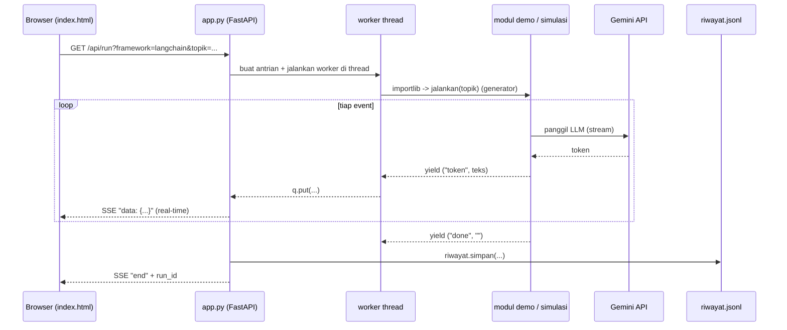

# Cara Kerja Kode Python

Dokumen ini menjelaskan **bagaimana kode Python di folder `demo/` bekerja**:
alur data dari klik tombol di browser sampai jawaban Gemini muncul, dan peran
tiap file. Cocok dibaca setelah `README.md` (cara pakai) dan `PERBANDINGAN.md`
(beda framework).

---

## 1. Peta file

```
demo/
├── config.py             # Otak konfigurasi: .env, LLM Gemini, fallback kuota
├── app.py                # Backend web (FastAPI), streaming SSE ke browser
├── simulasi.py           # "LLM palsu" saat tanpa API key / kuota habis
├── riwayat.py            # Simpan & baca riwayat run (file riwayat.jsonl)
├── 01_langchain_demo.py  # Demo LangChain  (chain linear)
├── 02_langgraph_demo.py  # Demo LangGraph  (graph berstate + loop)
├── 03_crewai_demo.py     # Demo CrewAI     (tim agent sequential)
├── 04_simulasi_offline.py# Peraga arsitektur murni, tanpa jaringan
├── 05_lihat_riwayat.py   # Pembaca riwayat lewat terminal
└── static/index.html     # UI web tiga panel
```

Aturan main yang membuat semuanya bisa disambung:

> **Setiap demo mengekspor fungsi `jalankan(topik)` yang merupakan _generator_
> dan meng-`yield` pasangan `(tipe, teks)`.**

`tipe` selalu salah satu dari: `"step"`, `"token"`, `"done"`, `"error"`.
Karena kontraknya seragam, `app.py` bisa memanggil framework mana pun dengan
kode yang sama, dan mode `simulasi.py` bisa menggantikan modul asli tanpa
mengubah apa pun di sisi UI.

---

## 2. Alur besar (dari klik sampai jawaban)



Poin penting: pekerjaan LLM berjalan di **thread terpisah**, sementara FastAPI
tetap `async`. Keduanya dijembatani sebuah `queue.Queue`. Ini perlu karena
kode framework bersifat _blocking_ (sinkron), tapi server web `async`.

---

## 3. `config.py` - pusat konfigurasi & ketahanan kuota

Ini file paling penting. Semua demo mengambil LLM dari sini, bukan membuat
sendiri.

### a. Load `.env` dan pilih model
```python
load_dotenv(ROOT / ".env")
MODEL = os.getenv("GEMINI_MODEL", "gemini-3.7-flash")
HEMAT = os.getenv("HEMAT", "1") not in ("0", "false", "no")
```
- `MODEL` = model utama.
- `HEMAT` = saklar hemat kuota (default nyala). Saat nyala, tiap demo memangkas
  jumlah panggilan LLM (lihat bagian 5).

### b. Satu API key saja
SDK Google rewel jika `GOOGLE_API_KEY` dan `GEMINI_API_KEY` sama-sama diset,
sedangkan CrewAI (lewat LiteLLM) butuh nama `GEMINI_API_KEY`. Jadi:
```python
if os.getenv("GOOGLE_API_KEY"):
    os.environ["GEMINI_API_KEY"] = os.environ.pop("GOOGLE_API_KEY")
```

### c. Rantai model cadangan
Free tier Gemini punya kuota **per model** (~20 request/hari). Kalau model
utama habis, kode geser ke model berikutnya di daftar `CADANGAN`:
```python
def rantai_model():           # [MODEL, lalu cadangan tanpa duplikat]
def model_tersedia():         # model pertama yang belum habis hari ini
```

Model yang kena error 429 dicatat ke disk (`.kuota_habis.json`) beserta
tanggalnya, supaya restart server tidak mengulang percobaan yang pasti gagal.
Karena kuota Gemini reset harian, catatan otomatis kedaluwarsa jika tanggalnya
berbeda dari hari ini:
```python
def _tandai_habis(model):     # tulis model + tanggal ke .kuota_habis.json
def _habis_hari_ini():        # baca; kosong kalau tanggalnya bukan hari ini
```

### d. Fallback otomatis untuk LangChain/LangGraph
```python
llm, nama = llm_dengan_fallback()
```
Memakai `with_fallbacks` bawaan LangChain: model cadangan **baru dipakai kalau
request asli gagal** (tidak ada "probe" yang memboroskan kuota). Sebuah
`BaseCallbackHandler` (`Pencatat`) memantau error; jika 429, nama model yang
habis dicatat lewat `_tandai_habis`, jadi run berikutnya langsung melompatinya.

CrewAI tidak punya `with_fallbacks`, jadi `03_crewai_demo.py` memilih model di
awal lewat `model_tersedia()` dan membuatnya dengan `crewai_llm()` (prefix
`gemini/` untuk LiteLLM).

### e. Normalisasi output
Model Gemini baru kadang mengembalikan `content` berupa list block
(`[{'type':'text','text':...}]`), bukan string. Helper `teks()` meratakannya
menjadi string biasa supaya kode pemanggil tidak perlu peduli bentuknya.

---

## 4. `app.py` - backend FastAPI + streaming SSE

### Endpoint
| Route | Fungsi |
|---|---|
| `GET /` | Kirim `static/index.html` |
| `GET /api/status` | Cek: API key ada? framework terinstall? model aktif? |
| `GET /api/run` | **Inti**: jalankan 1 framework, streaming hasilnya |
| `GET /api/riwayat` | Daftar run tersimpan + statistik |
| `GET /api/riwayat/{id}` | Detail satu run |
| `DELETE /api/riwayat` | Hapus semua riwayat |

### Cara `/api/run` bekerja
1. Validasi `framework` (`langchain`/`langgraph`/`crewai`).
2. Buat `queue.Queue` dan sebuah fungsi `worker()`.
3. `worker` mencoba `config.api_key()`:
   - **ada key** -> `importlib.import_module(...).jalankan(topik)` (modul asli).
   - **tidak ada key** -> `simulasi.jalankan(framework, topik)` (LLM palsu).
   Demo tetap jalan tanpa API key, hanya isinya simulasi.
4. Tiap event `(tipe, teks)` dari generator dimasukkan ke antrian via `q.put`.
5. Fungsi `gen()` (async) mengambil dari antrian dengan
   `loop.run_in_executor(None, q.get)` supaya tidak memblokir event loop,
   lalu membungkusnya jadi format SSE:
   ```python
   def _sse(tipe, data):
       return f"data: {json.dumps({'type': tipe, 'data': data})}\n\n"
   ```
6. Setelah generator selesai, seluruh event direkam ke riwayat lewat
   `riwayat.simpan(...)`, lalu event `end` berisi `run_id` dikirim.

### Pesan error yang ramah
`_pesan_ramah(e)` menerjemahkan error mentah Google menjadi instruksi
Bahasa Indonesia yang jelas: API key salah, 503 (server sibuk), 429 (kuota),
atau 404 (model dipensiunkan, lengkap dengan saran model pengganti yang
diambil dari pesan Google via regex).

---

## 5. Tiga modul demo: kontrak sama, arsitektur beda

Semua punya pola:
```python
def build(...):    # rakit objek framework
def jalankan(topik):  # generator yield ("step"/"token"/"done", teks)
def main():        # bisa dijalankan langsung dari terminal
```

### `01_langchain_demo.py` - chain linear (LCEL)
```python
chain = prompt | llm | StrOutputParser()          # dasar
bersusun = {"teks": chain} | kritik | llm | parser # output chain jadi input
paralel = RunnableParallel(ringkas=chain, analogi=...)  # dua cabang bareng
```
- Streaming pakai `chain.stream(...)` -> tiap potongan di-`yield` sebagai `token`.
- **Mode hemat**: hanya jalankan chain dasar (1 request), lewati bersusun &
  paralel. Konsep `prompt | llm | parser` tetap terlihat.

### `02_langgraph_demo.py` - graph berstate + loop revisi
- `State` = `TypedDict` dengan field `topik, draf, skor, kritik, putaran, log`.
  `log` memakai reducer `operator.add` (list-nya **digabung**, bukan ditimpa).
- Node:
  - `node_tulis` -> minta LLM menulis/merevisi paragraf.
  - `node_nilai` -> minta LLM memberi `SKOR:` dan `KRITIK:`, di-parse regex.
- `rute` (conditional edge): ulang ke `tulis` jika `skor < 8` **dan** belum
  mentok `BATAS_PUTARAN`, kalau tidak `END`.
- `checkpointer=MemorySaver()` + `thread_id` unik per run -> state tiap run
  terpisah, dan konsep resume/checkpoint terlihat.
- **Mode hemat**: `BATAS_PUTARAN = 1` (2 request); penuh = 3 putaran (6 request).

### `03_crewai_demo.py` - tim agent sequential
- Tiga `Agent`: Peneliti -> Penulis -> Editor, tiap satu punya
  `role/goal/backstory`.
- Tiga `Task` dirangkai lewat `context=[task_sebelumnya]` -> output diestafetkan.
- `Crew(process=Process.sequential)` lalu `crew.kickoff()` (blocking).
- Karena blocking, `jalankan` melaporkan hasil **per task** setelah selesai,
  bukan streaming token.
- **Mode hemat**: cukup 2 agent (Peneliti -> Penulis) dan `max_iter=1` tiap
  agent supaya tidak meledak jadi banyak panggilan LLM.

---

## 6. `simulasi.py` - jalan tanpa API key

Meniru alur ketiga framework dengan `_fake_llm` (teks dibuat lokal) dan
`_ketik` (streaming per kata supaya UI terasa hidup). Event yang dihasilkan
**identik** dengan modul asli (`(tipe, teks)`), sehingga UI tidak perlu tahu
ini simulasi. Berguna untuk memahami perbedaan arsitektur tanpa biaya kuota.

`04_simulasi_offline.py` versi lebih murni lagi: tiga fungsi Python biasa yang
memperlihatkan inti tiap pola (pipa lurus vs state machine vs estafet peran),
tanpa framework sama sekali. Bagus untuk membaca konsep dulu.

---

## 7. `riwayat.py` - penyimpanan tahan banting

- Format **JSON Lines** (`riwayat.jsonl`): satu baris = satu run. Kalau file
  terpotong di tengah penulisan, baris rusak cukup dilewati, sisanya tetap
  terbaca.
- `simpan()` menulis ke file `.tmp` lalu `replace()` (atomic) supaya aman jika
  proses mati di tengah jalan. Dilindungi `threading.Lock` untuk akses paralel.
- Menyimpan maksimal `MAKS = 200` run terakhir.
- `daftar()` mengembalikan ringkasan (tanpa isi event) + cuplikan token pertama;
  `ambil(id)` mengembalikan satu run penuh; `statistik()` menghitung total dan
  jumlah gagal per framework.

`05_lihat_riwayat.py` adalah pembaca CLI di atas `riwayat.py`: menampilkan
tabel daftar atau satu run penuh (`--id <ID>`), tanpa menyentuh Gemini.

---

## 8. Kenapa desainnya begini (ringkas)

| Keputusan | Alasan |
|---|---|
| Generator `(tipe, teks)` seragam | UI & backend tidak peduli framework mana; simulasi bisa menyamar |
| Worker thread + `queue` | Kode framework blocking, server FastAPI async |
| SSE, bukan WebSocket | Cukup untuk aliran satu arah server->browser, lebih sederhana |
| Fallback model + cache disk | Kuota free tier ketat; hindari mengulang request yang pasti 429 |
| Mode `HEMAT` | Sekali "Jalankan Semua" cuma ~5 request, bukan ~20 |
| Riwayat JSON Lines atomic | Bisa membaca ulang hasil tanpa memakai kuota, aman dari korupsi file |

---

## 9. Menjalankan & menelusuri sendiri

```bash
# paham konsep dulu, tanpa API key
.venv/bin/python demo/04_simulasi_offline.py

# jalankan satu framework asli dari terminal (pakai .env)
.venv/bin/python demo/01_langchain_demo.py
.venv/bin/python demo/02_langgraph_demo.py   # + gambar ASCII graph di akhir
.venv/bin/python demo/03_crewai_demo.py

# lihat riwayat
.venv/bin/python demo/05_lihat_riwayat.py

# UI web penuh
./run.sh   # buka http://127.0.0.1:8765
```

Titik masuk terbaik untuk membaca kode: mulai dari `config.py` (LLM & kuota) ->
`app.py` fungsi `run()` (jembatan) -> salah satu `0X_..._demo.py` (arsitektur).
